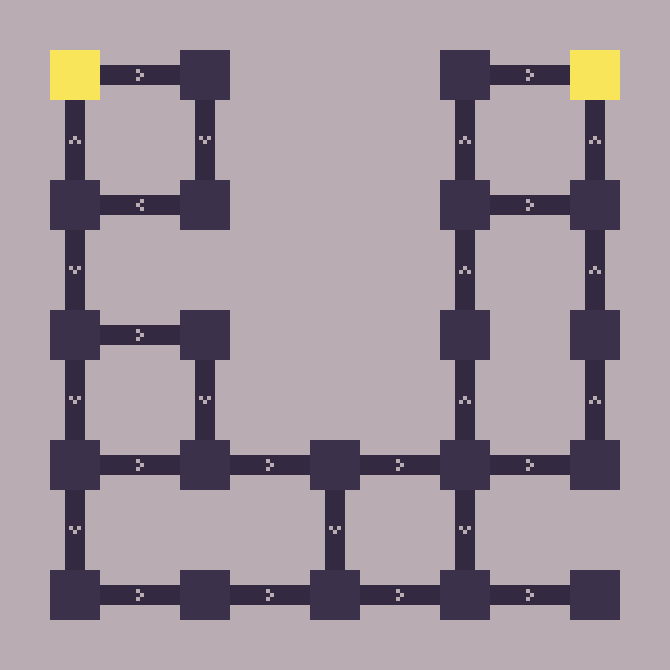
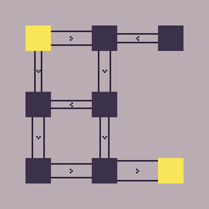

# Graph Algorithms Visualization

This project is a tool for visualization runs of algorithms on a grid-like graphs. User chooses algorithm and provides info about grid-like graph with with color preferences and the program visualizes each step of the algorithm and saves it as a animated GIF.

Example of the BFS algorithm visualization.



## Project proposal

> Note: Original proposal was written in czech and was iterated on in email communication. This is translation and summary of the conversation.

The goal of this project is to design and implement (in C++) a tool for visualization of graph algorithms (e.g. shortest path finding or maximal flow finding algorithms). Only graphs representable by a grid would be supported and the output would be animated GIF. User would choose algorithm and provide info about grid-like graph with with color preferences and the program would visualize each step of the algorithm. Breadth-First-Search algorithm and Ford-Fulkerson algorithm would be implemented and shown as examples of the usage of the framework.

## User documentation

Section in which we describe how to build and run visualization tool and explain how to use it.

### How to BUILD

After cloning the project building is quite simple, because the project is self-containded (has no external dependencies). Just regular ```cmake``` is needed.

Go through the following steps on linux:

- create directory called ```build``` in the ```project``` folder (```mkdir build```)
- go into that folder (```cd build```)
- run ```cmake ../src```
- and finally run ```cmake --build .```
- there should be executable file called ```graph_algorithm_visualizer``` in the directory

On windows VisualStudio supports and automaticaly detects CMake files and when asked you just need to navigate it to the ```CMakeLists.txt``` file in the ```src``` folder.

Program was tested and works both on Linux (Fedora 40) and Windows (10 Profesional).

### How to RUN

After building try running the executable ```graph_algorithm_visualizer``` with parameter ```--help``` (```./graph_algorithm_visualizer --help``` on linux)

Output should be the following:

    Usage: ./grid_algorithm_visualiser ALGORITHM GRAPH_CONFIG_FILE OUTPUT_FILE
    Visualize a run of given ALGORITHM on a (grid) graph defined in a GRAPH_CONFIG_FILE and save it to OUTPUT_FILE.

    Only supported ALGORITHMs are:
        BFS (Breadth-First-Search) shortest path finding algorithm
        FF-BFS (Ford-Fulkerson with BFS) maximal flow finding algorithm

    Only supported output format is .gif

Which is basic info about usage of the program.

#### Config files

Both algorithms use kind of similar but different config files for configuration of the graph and algorithm. They are different because of the special need of a flow graph and algorithms that visualize it.

##### Breadth-First-Search

BFS algorithm uses path finding graph config which follows this pattern:

    [GRID DATA]
    WIDTHxHEIGHT
    START_NODE_INDEX
    END_NODE_INDEX

    # IGNORED SINGLE-LINE COMMENT

    [NODES]
    NODE_GRID_X NODE_GRID_Y
    NODE_GRID_X NODE_GRID_Y
    NODE_GRID_X NODE_GRID_Y
    ...

    [EDGES]
    FROM_NODE_INDEX TO_NODE_INDEX
    FROM_NODE_INDEX TO_NODE_INDEX
    FROM_NODE_INDEX TO_NODE_INDEX
    ...

    [VISUALIZATION]
    NODE_SIZE_IN_PIXELS
    EDGE_LENGTH_IN_PIXELS
    EDGE_WIDTH_IN_PIXELS
    FRAME_DELAY_IN_TENS_OF_MILISECONDS
    BACKGROUD_COLOR_R BACKGROUD_COLOR_G BACKGROUD_COLOR_B

    [NODE PALETTE]
    UNFOUND_NODE_COLOR_R UNFOUND_NODE_COLOR_G UNFOUND_NODE_COLOR_B
    FOUND_NODE_COLOR_R FOUND_NODE_COLOR_G FOUND_NODE_COLOR_B
    VISITED_NODE_COLOR_R VISITED_NODE_COLOR_G VISITED_NODE_COLOR_B
    ON_SHORTEST_PATH_COLOR_R ON_SHORTEST_PATH_COLOR_G ON_SHORTEST_PATH_COLOR_B
    START_NODE_COLOR_R START_NODE_COLOR_G START_NODE_COLOR_B
    END_NODE_COLOR_R END_NODE_COLOR_G END_NODE_COLOR_B

    [EDGE PALETTE]
    DEFAULT_EDGE_COLOR_R DEFAULT_EDGE_COLOR_G DEFAULT_EDGE_COLOR_B
    PEEKED_EDGE_COLOR_R PEEKED_EDGE_COLOR_G PEEKED_EDGE_COLOR_B
    USED_EDGE_COLOR_R USED_EDGE_COLOR_G USED_EDGE_COLOR_B
    ON_SHORTEST_PATH_COLOR_R ON_SHORTEST_PATH_COLOR_G ON_SHORTEST_PATH_COLOR_B
    ARROW_COLOR_R ARROW_COLOR_G ARROW_COLOR_B

Lines within ```[]``` are separating different sections of the config file. All the sections are mandatory and need to stay in the config file.
Also all the items in the sections are mandatory, except items in ```[NODES]``` and ```[EDGES]``` of which there can be different amount (this is symbolized in the template by ```...```). Items on the same line have to be separated by (any) whitespace (except WIDTHxHEIGHT which are separated by ```x```) and one item has to be on one line just like shown in the template (RGB values of a color, node indecies etc. are taken as one item). Any empty lines are ignored. Config also supports sigle-line comments, any line starting with ```#``` is ignored.

This [example BFS config file](../data/ExampleBFSConfig.txt) gives the following output.


##### Ford-Fulkerson (with BFS)

Pattern for config file of the Ford-Fulkerson algorithm:

    [GRID DATA]
    WIDTHxHEIGHT
    START_NODE_INDEX
    END_NODE_INDEX

    # IGNORED SINGLE-LINE COMMENT

    [NODES]
    NODE_GRID_X NODE_GRID_Y
    NODE_GRID_X NODE_GRID_Y
    NODE_GRID_X NODE_GRID_Y
    ...

    [EDGES]
    FROM_NODE_INDEX TO_NODE_INDEX CAPACITY
    FROM_NODE_INDEX TO_NODE_INDEX CAPACITY
    FROM_NODE_INDEX TO_NODE_INDEX CAPACITY
    ...

    [VISUALIZATION]
    NODE_SIZE_IN_PIXELS
    EDGE_LENGTH_IN_PIXELS
    EDGE_WIDTH_IN_PIXELS
    FRAME_DELAY_IN_TENS_OF_MILISECONDS
    BACKGROUD_COLOR_R BACKGROUD_COLOR_G BACKGROUD_COLOR_B

    [NODE PALETTE]
    DEFAULT_NODE_COLOR_R DEFAULT_NODE_COLOR_G DEFAULT_NODE_COLOR_B
    ON_UNSATURATED_PATH_COLOR_R ON_UNSATURATED_PATH_COLOR_G ON_UNSATURATED_PATH_COLOR_B
    START_NODE_COLOR_R START_NODE_COLOR_G START_NODE_COLOR_B
    END_NODE_COLOR_R END_NODE_COLOR_G END_NODE_COLOR_B

    [EDGE PALETTE]
    DEFAULT_EDGE_COLOR_R DEFAULT_EDGE_COLOR_G DEFAULT_EDGE_COLOR_B
    ON_UNSATURATED_PATH_COLOR_R ON_UNSATURATED_PATH_COLOR_G ON_UNSATURATED_PATH_COLOR_B
    SATURATED_EDGE_COLOR_R SATURATED_EDGE_COLOR_G SATURATED_EDGE_COLOR_B
    BORDER_COLOR_OFFSET_R BORDER_COLOR_OFFSET_G BORDER_COLOR_OFFSET_B
    ARROW_COLOR_R ARROW_COLOR_G ARROW_COLOR_B

The config is kind of the same, but with different colorable states and with added capacity to the edges.

This [example FF-BFS config file](../data/ExampleFF-BFSConfig.txt) gives the following output.



You can run the examples in ```../data``` folder or modify them for your own graphs.

> Note: There is no way to specify exact dimensions of the final GIF, since it is calculated automaticaly from the input graph and sizes of nodes and edges.

## Program documentation

Program documentation can be seen [here](ProgramDocumentation.md).
